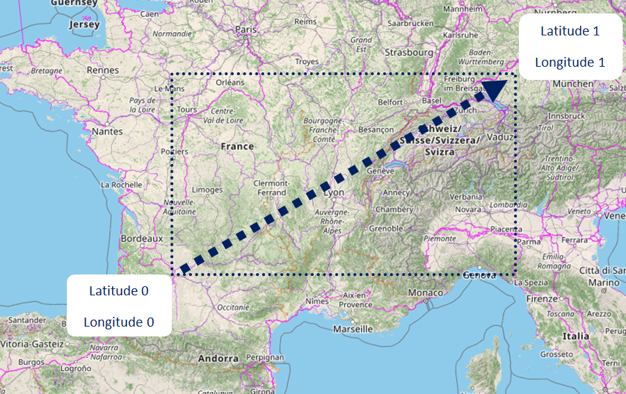

# Open Street Maps - Offline

Open Street Maps tile downloader script for offline usge. A small example of offline tile usage.

I was looking for a fast and easy way to download and use OSM tiles to my projects. Google Maps provides a big and excellent documentation of how to use every part of the API and the maps. For Open Street Maps is a lit bit trickier and more difficult.

Inspired by this [script](https://gist.github.com/tonyrewin/9444410).

## Description

Use [osm.py](https://github.com/georgealexakis/osm-offline/blob/main/osm.py) script and download tiles in .png format.

## How to choose coordinates

``` $ python osm.py <start lat> <start lng> <finish lat> <finish lng> <min zoom> <max zoom> <type> ```

Start lat, lng must be lower than finish lat, lng as image below.



## Examples

Open Street Maps

``` $ python osm.py 34.979067 23.350545 35.485885 26.310979 0 6 osm ```

Satelite Images

``` $ python osm.py 34.979067 23.350545 35.485885 26.310979 7 10 world ```

## Use Maps Offline

``` $ git clone https://github.com/georgealexakis/osm-offline.git ```

``` $ cd osm-offline ```

``` $ npm install ```

View [index.html](https://github.com/georgealexakis/osm-offline/blob/main/index.html) on web browser.
